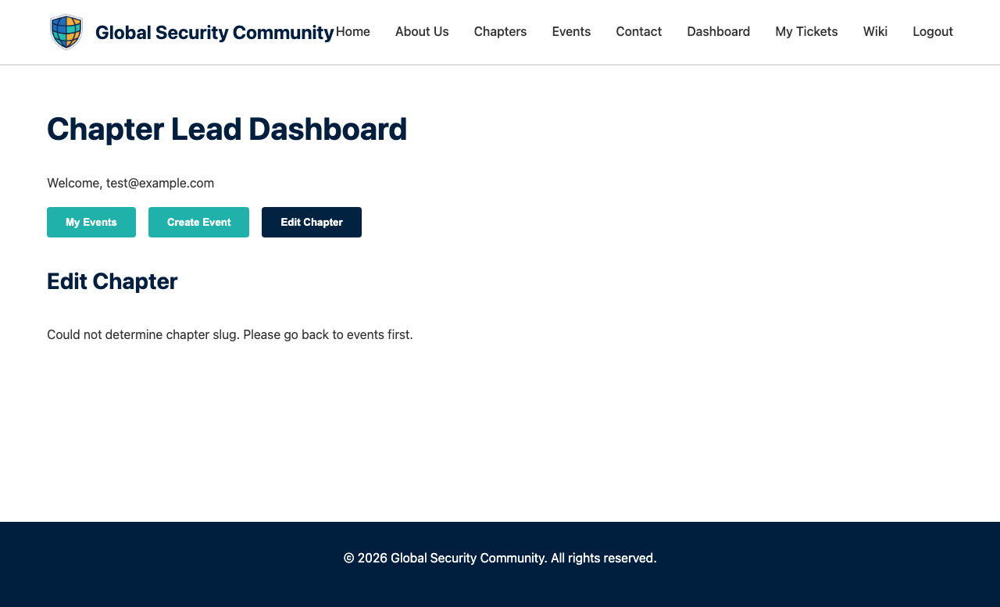

# Chapter Lead Dashboard

The Dashboard is the management hub for chapter leads to create and manage events.

## URL

`/dashboard/`

## Access

Requires the **admin** role. Only approved chapter leads are automatically assigned this role. Other users will receive a 403 Forbidden response.

!!! info "How admin role works"
    When a user logs in, the system checks if their email matches an approved chapter lead in the database. If it does, they are automatically assigned the admin role.

## Features

### Event Management

- **Create Event** — Form to create a new bootcamp event with:

    

    - Event title
    - Start and end dates
    - Location
    - Description
    - Registration capacity (0 = unlimited)
    - Sessionize API ID (optional, for agenda/speaker integration)
    - Chapter association

- **Event List** — View all events you've created with current registration counts

- **Event Status** — Update event status (open, closed, completed)

### Sessionize Setup

Before creating an event, you can optionally set up [Sessionize](https://sessionize.com) to manage session submissions, speaker information, and event scheduling. The Sessionize API ID is entered during event creation on the dashboard.

#### Step 1: Create and Configure a Sessionize Event

1. Go to [Sessionize.com](https://sessionize.com) and create an account if you don't have one
2. Create a new event for your bootcamp
3. Set it up with as much detail as possible:
    - Event name and description
    - Event dates
    - Location information
    - Social media and website links

#### Step 2: Apply for Free Community License

Sessionize offers free licenses for community-run, volunteer-organized events. To apply:

1. Visit https://sessionize.com/playbook/community-license
2. Scroll to the "How to request a free community license?" section
3. Click **Community License Request Form**
4. Fill out the form with the following information:
    - **Who Can Attend** — Anyone (open to the public)
    - **How Much do the tickets cost** — 0 (free event)
    - **Who is organising the event** — A group of individuals
    - **Are the organisers paid** — No, they are volunteers
    - **Does the event make a profit** — No, the organisers cover the cost to keep it running
    - **Link the community website** — Link to the global security community website or your associated chapter page
    - **Comment or Remark** — Include a statement such as:
        > "As a volunteer‑run, free event, we truly appreciate tools that empower community initiatives without adding financial strain. Sessionize's support would make a real difference in helping us deliver an impactful and free experience for our attendees."
    - **Full name** — Name of the person responsible for the submission
5. Submit the form

!!! note
    It may take up to 24 hours (or longer during weekends and holidays) for the community license request to be reviewed and manually activated. Plan ahead when scheduling your event. If you have questions, contact Sessionize Support.

#### Step 3: Set Up Sessionize API

Once your Sessionize event is created and your community license is activated, configure the API endpoint:

1. In your Sessionize event dashboard, navigate to **API / Embed**
2. Click **Create a New Endpoint**
3. Set the format to **JSON**
4. Keep all other configuration settings at their defaults
5. After creation, you'll receive an **Endpoint ID** — save this ID, as you'll need it when creating your event

!!! tip "Using the Sessionize API ID"
    When creating or editing an event on the [Dashboard](dashboard.md), paste the Sessionize Endpoint ID in the **Sessionize API ID** field. Once configured, the event detail page will automatically fetch and display:
    - Session agenda and schedule
    - Speaker profiles and bios
    - Call for papers information

### Volunteers / Committee

- **Volunteer Interest** — Attendees who expressed volunteer interest during registration are shown with a 🙋 icon in the attendance list, making it easy to identify potential volunteers
- **Add Volunteers** — Assign volunteers or committee members to an event by entering their name and email
- **Volunteer Access** — Volunteers get access to the QR check-in scanner for the event without full admin privileges
- **Remove Volunteers** — Remove volunteer access at any time from the event detail view

!!! note
    Volunteers must have a GSC account (signed up via the website). When they log in, the system automatically detects their email and grants them the volunteer role.

### Attendance

- **Attendance Dashboard** — Real-time view of check-ins for an event:
    - Total registered vs checked-in count
    - Individual attendee check-in status
- **CSV Export** — Download a CSV of all registrations for reporting
- **Scanner Link** — Quick link to the QR scanner page for event-day check-in

### Badges

- **Issue Badges** — After an event, generate and email digital badges to:
    - Attendees (who checked in)
    - Speakers
    - Organisers / Volunteers

## Event Creation Flow

1. Fill in the event details on the dashboard
2. Click "Create Event"
3. The system:
    - Stores the event in the database
    - Triggers a GitHub Action to generate a dedicated event page
    - Posts a notification to the chapter's Discord channel
4. The event appears on the website within a few minutes

## Related Pages

- [Events](events.md) — Public event listings
- [Scanner](scanner.md) — QR code check-in tool
- [Badges](badges.md) — Digital badge system
- [Chapter Lead Application](chapter-application.md) — How to become a chapter lead

### Chapter Editing

Chapter leads can update their chapter information directly from the Dashboard:

The chapter edit form allows you to update:

- **Chapter leads** — Up to 4 leads with name and LinkedIn profile
- **Social links** — GitHub, LinkedIn, Twitter/X, and website URLs

Changes are saved immediately and reflected on the chapter's public page.
